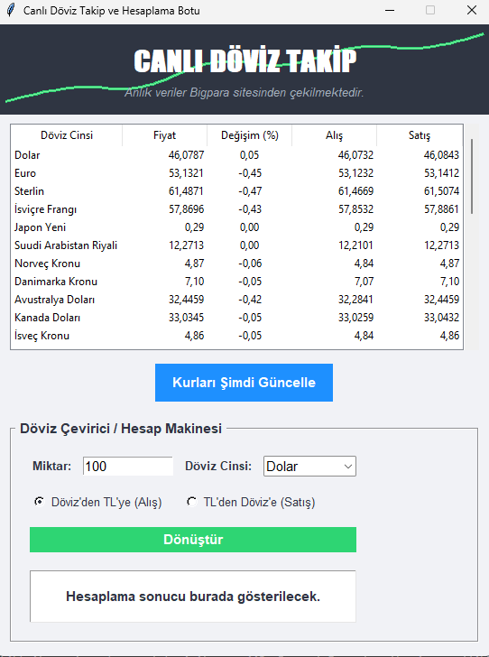

# 📂 Proje #15 — İnternetten Veri Çeken Bot Uygulaması

Hürriyet Bigpara finans portalı üzerinden canlı döviz kurlarını (Dolar, Euro, Altın vb.) BeautifulSoup4 ile çeken ve bu kurlarla dönüştürme işlemleri (Alış/Satış) yapabilen modern arayüzlü (GUI) bir döviz takip botudur.



## 📄 Klasör İçeriği
- `internetden_veri_cekme.py`: Canlı döviz takip ve hesaplama botu ana kod dosyası.
- `internetden_veri_cekme_Aciklamalari.ipynb`: Web scraping, BeautifulSoup, Tkinter Treeview ve hesaplama mantığını adım adım anlatan Jupyter Notebook dosyası.
- `public/ekran_goruntusu.png`: Uygulamanın çalışma anına ait ekran görüntüsü.

## 📦 Gerekli Kütüphaneler
- `requests`
- `beautifulsoup4`
- `tkinter` (Python ile yerleşik gelir)

## 🚀 Çalıştırma
```bash
python internetden_veri_cekme.py
```
