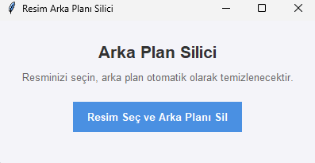

# 📂 Proje #17 — Görüntülerden Arka Planı Silen Uygulama

Bu uygulama, resimlerin arka planlarını yapay zeka (AI) yardımıyla tek tıkla otomatik olarak silen ve transparan (şeffaf) PNG formatında kaydeden grafik arayüzlü (GUI) bir Python programıdır.

Uygulamanın arayüz tasarımı ve çalışmasından bir ekran görüntüsü:

<p align="center">
  
</p>

---

## 🚀 Özellikler

- **Kolay Kullanım:** "Resim Seç ve Arka Planı Sil" butonuna basarak bilgisayarınızdaki herhangi bir resmi seçebilirsiniz.
- **Yapay Zeka Destekli:** `rembg` kütüphanesinin arka planda çalıştırdığı derin öğrenme modeli (**U2-Net**) sayesinde saç telleri ve ince detaylar gibi karmaşık arka planları bile yüksek hassasiyetle ayırır.
- **Güvenli Kayıt:** Temizlenen görsel transparanlığını kaybetmemesi amacıyla doğrudan `.png` formatında kaydedilir.
- **Hata Yönetimi:** Dosya seçmeme, geçersiz format yükleme veya sistem hatalarında kullanıcıyı bilgilendiren Türkçe pop-up uyarılar içerir.

---

## ⚙️ Kurulum ve Gereksinimler

Uygulamanın çalışması için aşağıdaki paketlerin kurulması gerekmektedir:

```bash
# 1. Gerekli kütüphaneleri yükleyin
pip install rembg pillow

# 2. Eğer ONNX Runtime bulunamadı hatası alırsanız CPU desteğini yükleyin
pip install "rembg[cpu]"
```

*Not: Uygulama ilk kez arka plan silme işlemi gerçekleştirdiğinde, AI modelini (`u2net.onnx` ~176 MB) otomatik olarak bilgisayarınıza indirecektir. Bu indirme internet hızınıza bağlı olarak ilk seferde biraz sürebilir, sonraki işlemler ise yerel önbellek kullanıldığı için anında tamamlanır.*

---

## 💻 Kullanım

Uygulamayı başlatmak için terminal veya komut satırından projenin olduğu dizine gidip şu komutu çalıştırabilirsiniz:

```bash
python arka_plan_sil.py
```

1. Açılan pencerede **"Resim Seç ve Arka Planı Sil"** butonuna tıklayın.
2. Açılan pencereden arka planını temizlemek istediğiniz resmi seçin.
3. Ardından yeni şeffaf resmi nereye ve hangi isimle kaydetmek istediğinizi seçip onaylayın.
4. Arka plan silme işlemi tamamlandığında ekranda "Başarılı" bildirimi belirecektir.

---

## 🛠️ Kullanılan Teknolojiler

- **[rembg](https://github.com/danielgatis/rembg):** Yapay zeka tabanlı arka plan temizleme işlemlerini yürüten kütüphane (arka planda ONNX Runtime ve PyTorch/U2-Net modelleri çalışır).
- **[Tkinter](https://docs.python.org/3/library/tkinter.html):** Python'ın yerleşik masaüstü grafik arayüz (GUI) kütüphanesi.
- **[Pillow (PIL)](https://python-pillow.org/):** Görüntü okuma, manipülasyon ve Tkinter üzerinde görsel gösterme/işleme aracı.

---

## 📘 Eğitim İçeriği

Bu projenin arkasındaki teorik bilgileri, derin öğrenme modelinin çalışma şeklini, ONNX yapısını ve kod satırlarının detaylı açıklamalarını öğrenmek için proje klasöründeki [arka_plan_sil_Aciklamalari.ipynb](./arka_plan_sil_Aciklamalari.ipynb) isimli Jupyter Notebook dosyasını inceleyebilirsiniz.
