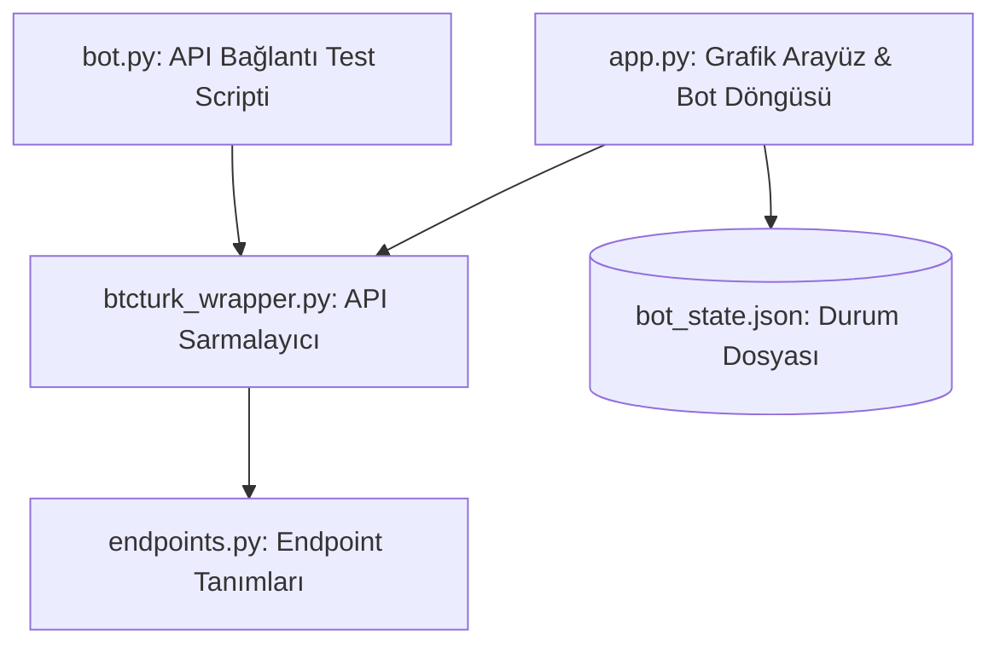

# 📂 Proje #19 — Kripto Botu (Beta)


Bu proje, **BtcTurk** borsası REST API'si ile entegre çalışan, hem manuel işlemler yapabileceğiniz hem de geliştirdiğimiz **5 dakikalık gözlem ve kâr hedefli otomatik ticaret algoritmasını** koşturabileceğiniz, çok kanallı (Genel/Alım/Satım) log sistemine sahip, asenkron (multi-threaded) bir masaüstü kontrol panelidir.

---

## 📐 Mimari ve Dosya İlişkileri

Uygulama, modüler bir yapıda 4 ana python kod bileşeninden oluşur:



- **`endpoints.py`:** BtcTurk API uç noktalarını (endpoints), HTTP metotlarını ve gerekli yetki seviyelerini barındıran ayar dosyasıdır.
- **`btcturk_wrapper.py`:** API isteklerini imzalayan (HMAC-SHA256, Base64) ve borsa isteklerini (bakiye, ticker, emir gönderme/iptal) sarmalayan sınıfı içerir.
- **`bot.py`:** API anahtarlarının borsayla başarılı bir bağlantı kurup kuramadığını test etmek için yazılmış basit konsol scriptidir.
- **`app.py`:** Uygulamanın beynidir. Tkinter arayüzünü oluşturur, verileri Treeview tablolarında gösterir, logları ayrıştırır ve otomatik ticaret döngüsünü arka planda (`threading`) yönetir.

---

## 🔑 API Anahtarları ve Güvenlik Yapılandırması (Kritik!)

Uygulamanın hesabınız adına işlem yapabilmesi için BtcTurk PRO üzerinden ürettiğiniz API anahtarlarını girmeniz gerekmektedir.

### 1. BtcTurk API Anahtarı Alımı ve Yetkileri
- BtcTurk PRO hesabınıza giriş yapın.
- Profil menüsünden **API Yönetimi** sayfasına gidin.
- Yeni bir API Anahtarı oluşturun ve aşağıdaki yetkileri **kesinlikle** aktif edin:
  - **Total Funds (Toplam Varlık):** Cüzdan bakiyelerini okumak için gereklidir.
  - **Trade (Al-Sat):** Alış ve satış emri göndermek/iptal etmek için gereklidir.

### 2. Kod Üzerinde Anahtar Güncelleme Adımları
Projeyi indirdikten sonra, kendi API anahtarlarınızı aşağıdaki dosyalardaki **placeholder (yer tutucu)** alanlara yapıştırmalısınız:

- **`app.py` Dosyasında (Satır 28-29):**
  ```python
  PUBLIC_KEY = "BURAYA_KENDI_PUBLIC_KEYINIZI_YAZIN"
  PRIVATE_KEY = "BURAYA_KENDI_PRIVATE_SECRET_KEYINIZI_YAZIN"
  ```
- **`bot.py` Dosyasında (Satır 16-17):**
  ```python
  public_key = "BURAYA_KENDI_PUBLIC_KEYINIZI_YAZIN"
  private_key = "BURAYA_KENDI_PRIVATE_SECRET_KEYINIZI_YAZIN"
  ```

> ⚠️ **Güvenlik Uyarısı:** `Private Key` (Gizli Anahtar) değeriniz şifreniz kadar değerlidir. Bu anahtarları asla GitHub gibi halka açık ortamlarda paylaşmayın! Proje klasöründeki `.gitignore` dosyası, API bilgilerini veya loglarınızı içeren geçici dosyaların (`bot_state.json` vb.) yanlışlıkla commit edilmesini önlemek üzere yapılandırılmıştır.

---

## 📝 Modül ve Kod Seviyesinde Detaylı Açıklamalar

### 1. `endpoints.py` (API Endpoint Tanımlamaları)
Bu dosya, BtcTurk API istek yollarını ve metot tiplerini merkezi bir sözlükte (`ENDPOINTS`) tutar. Kod içerisinde ek bir URL düzenleme karmaşasını önler.
- `balances`: `/api/v1/users/balances` (GET, Yetki: Total Funds)
- `new_order`: `/api/v1/order` (POST, Yetki: Trade)
- `cancel_order`: `/api/v1/order` (DELETE, Yetki: Trade)
- `ticker`: `/api/v2/ticker` (GET, Yetki: Herkese Açık)

### 2. `btcturk_wrapper.py` (API Sarmalayıcı Sınıfı)
BtcTurk API'sinin en karmaşık kısmı, **kimlik doğrulama imzası (signature)** oluşturulmasıdır.
- **İmza Mantığı:** Sunucuya gönderilecek mesaj, Public Key ve milisaniye bazlı anlık zaman damgasının (stamp) birleştirilmesiyle (`PUBLIC_KEY + STAMP`) elde edilir. Bu mesaj, Base64 ile decode edilmiş Private Key kullanılarak `HMAC-SHA256` ile imzalanır ve tekrar Base64 olarak kodlanır.
- **Hassasiyet Yönetimi:** Kripto borsalarında sipariş verirken basamak sayısı hassasiyetleri çok önemlidir (örneğin BTC için 8 basamak, TRY için 2 basamak). Sınıf içindeki `round_pair`, `numerator_scale` ve `denominator_scale` fonksiyonları, BtcTurk kurallarına (`denominatorScale` / `numeratorScale`) göre sayıları aşağı yuvarlayarak **"Geçersiz Basamak/Miktar"** hatalarını önler.
- **İşlem Tipi Yönetimi:** BtcTurk market alımlarında miktar alanını **TRY** cinsinden, limit alımlarda ve tüm satışlarda ise **kripto para** cinsinden bekler. `submit_order` fonksiyonu bu ayrımı otomatik olarak yönetir.

### 3. `bot.py` (Bağlantı Test Scripti)
Ana kontrol panelini açmadan önce API anahtarlarınızın doğru yetki ve biçimde çalışıp çalışmadığını doğrulamak için yazılmıştır. `bt.get_ticker_currency("USDT")` çağrısı yaparak USDT fiyatını terminale JSON formatında döker. Eğer terminale anlamlı bir JSON objesi basılıyorsa bağlantınız hazırdır.

### 4. `app.py` (Tkinter GUI ve Bot Kontrol Paneli)
- **Arayüz Elemanları:** 3 adet ayrı log kutusu (Genel, Alım, Satım), Hedef Kâr Oranı ve Bakiye Oranı giriş kutuları, Güncel TRY Bakiyesi, Aktif TRY Pariteleri (Treeview) ve Kullanıcının Varlıkları (Treeview) tablolarından oluşur.
- **Sıralama Desteği:** Tablo başlıklarına tıklandığında pariteleri fiyata, günlük değişim oranına veya durumuna göre sayısal ve alfabetik olarak sıralar (`sort_treeview`).
- **Asenkron Çalışma (Threading):** İnternet üzerinden veri çekme işlemleri Tkinter ana arayüz döngüsünü (Main Thread) dondurmasın diye tüm API istekleri `threading.Thread` ile arka planda çalıştırılır.
- **Thread-Safety (root.after):** Arka plan thread'lerinin Tkinter nesnelerine doğrudan müdahale etmesi güvensizdir. Bu nedenle işlemler tamamlandığında arayüz güncellemeleri `root.after(0, callback)` aracılığıyla ana thread'e güvenli bir şekilde aktarılır.
- **Kayıt Yönetimi (`STATE_FILE`):** Bot kapatıldığında veya yeniden başlatıldığında maliyet bilgileri (`avg_buy_price`), aktif bot durumları (`auto_running`) ve log geçmişi kaybolmasın diye her adımda `bot_state.json` dosyasına kaydedilir.

---

## 📈 Otomatik Ticaret Algoritması (5 Dakika Gözlem Stratejisi)

Botun otomatik al-sat döngüsü şu şekilde çalışır:

1. **Gözlem Aşaması (5 Dakika / 300 Saniye):**
   - Belirlenen parite için 5 dakika boyunca her 10 saniyede bir (toplam 30 kere) anlık fiyat çekilir.
   - Bu süreç boyunca paritenin gördüğü en düşük fiyat (**dip fiyat**) tespit edilir.
2. **Alım Aşaması:**
   - 300 saniye tamamlandığında anlık fiyattan dip tespitiyle alım kararı verilir.
   - Cüzdandaki kullanılabilir TRY bakiyesi sorgulanır.
   - Arayüzden girilen **"Kullanılacak Bakiye Oranı"** (Örn: %50) kadar TRY ile market fiyatından alış emri gönderilir.
   - Alım gerçekleştikten sonra alınan coin miktarı ve ortalama maliyet (fiyat) sisteme kaydedilerek `bot_state.json` içerisine yazılır.
3. **Takip ve Satış Aşaması:**
   - Her 5 saniyede bir ilgili coinin anlık fiyatı borsadan sorgulanır.
   - Arayüzde belirtilen **"Hedef Kâr Oranı"** (Örn: %2) maliyetin üzerine eklenerek satış hedef fiyatı belirlenir.
   - Anlık borsa fiyatı, satış hedef fiyatına ulaştığı veya üzerine çıktığı anda anında piyasa fiyatından market satış emri verilerek kâr realize edilir. Bot başarıyla durdurulur.

---

## 🚀 Kurulum ve Çalıştırma

### 1. Bağımlılıkların Yüklenmesi
Uygulama sadece `requests` kütüphanesine ihtiyaç duyar:
```bash
pip install requests
```

### 2. API Bağlantısını Doğrulamak (Konsol Testi)
API anahtarlarınızı `bot.py` içerisine yazdıktan sonra çalıştırın:
```bash
python bot.py
# veya
py bot.py
```

### 3. Kontrol Panelini Başlatmak
API anahtarlarınızı `app.py` içerisine yazdıktan sonra arayüzü başlatın:
```bash
python app.py
# veya
py app.py
```
Uygulama açıldığında sol taraftaki parite tablosundan işlem yapmak istediğiniz çifti seçip sağ tıklayarak botu başlatabilir, manuel al-sat yapabilir veya kâr oranlarını panel üzerinden dinamik olarak ayarlayabilirsiniz.
