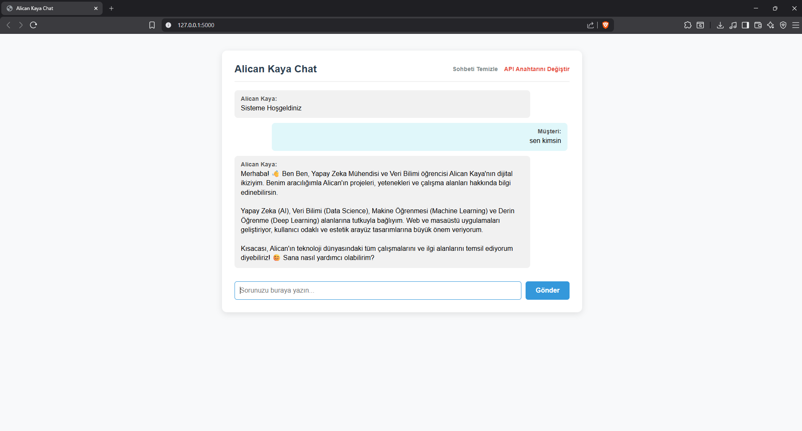

# 🤖 Proje #20 — Yapay Zeka Asistanı Botu (Alican Kaya Dijital İkizi)

Bu uygulama, **Flask** web çatısı ve **Google Gemini API** (`google-generativeai`) kütüphanesini bir araya getirerek, Yapay Zeka Mühendisi ve Veri Bilimi Öğrencisi Alican Kaya'nın projelerini, yeteneklerini ve özgeçmişini ziyaretçilere birinci şahıs ağzından tanıtan interaktif bir dijital ikiz asistanıdır.

<p align="center">
  
</p>

---

## 🚀 Özellikler

- **Diyalog Hafızası (Session Management):** Flask oturum çerezlerini (cookie) kullanarak kullanıcının önceki mesajlarını akılda tutar.
- **Güvenli API Yönetimi:** API anahtarı hiyerarşik olarak aranır:
  1. Kod içerisindeki statik değişken (`API_KEY_IN_CODE`).
  2. İşletim sistemi çevre değişkeni (`GEMINI_API_KEY`).
  3. Arayüz üzerinden kullanıcının girdiği session anahtarı.
- **Dinamik Model ve Hata Önleme (Fallback):** API anahtarının yetkili olduğu modeller taranır. Kota aşımı (429) veya model bulunamama (404) gibi bir hata durumunda uygulama çökmeden otomatik olarak sıradaki Gemini modeline geçiş yapar (`gemini-2.0-flash`, `gemini-1.5-flash`, `gemini-1.5-pro`, `gemini-pro`).
- **Kurumsal Kimlik (System Instruction):** Yapay zeka modeli arka planda Alican Kaya'nın kimliğini, projelerini ve davranış kurallarını içeren bir talimat seti ile yönlendirilir.

---

## ⚙️ Kurulum ve Gereksinimler

```bash
# Flask ve Google Generative AI kütüphanelerini yükleyin
pip install flask google-generativeai
```

**Gerekli Python Sürümü:** Python 3.8+

---

## 💻 Kullanım

```bash
# Sunucuyu başlatın
python yapay_zeka_asistan_app.py
```

1. Uygulama lokalinizde `http://127.0.0.1:5000` adresinde çalışmaya başlayacaktır.
2. Eğer koda API anahtarı gömmediyseniz veya çevre değişkeni tanımlamadıysanız, arayüzde sizden bir Gemini API anahtarı istenir.
3. API anahtarı kaydedildikten sonra asistanla konuşmaya başlayabilirsiniz.
4. "Sohbeti Temizle" seçeneği ile hafızayı sıfırlayabilir, "API Anahtarını Değiştir" seçeneğiyle farklı bir anahtar tanımlayabilirsiniz.

---

## 🛠️ Kullanılan Teknolojiler

| Kütüphane | Açıklama |
|-----------|----------|
| [**Flask**](https://flask.palletsprojects.com/) | Python mikro web çatısı — yönlendirmeler ve oturum yönetimi |
| [**google-generativeai**](https://pypi.org/project/google-generativeai/) | Google Gemini modellerine bağlanmak ve içerik üretmek için resmi SDK |
| **jinja2** | HTML sayfalarını dinamik verilerle render eden şablon motoru |

---

## 📘 Eğitim İçerikleri

Bu projenin arkasındaki teknik detayları öğrenmek için proje klasöründeki notebook dosyalarını inceleyebilirsiniz:

| Dosya | Açıklama |
|-------|----------|
| [**yapay_zeka_asistan_app_Aciklamalari.ipynb**](./yapay_zeka_asistan_app_Aciklamalari.ipynb) | Uygulamanın tüm kaynak kodlarını, rotalarını ve Gemini fallback sistemini satır satır açıklayan notebook |
| [**flask_rehber.ipynb**](./flask_rehber.ipynb) | Flask web çatısını, rotalama mantığını, session yönetimini ve Jinja2 şablon motorunu sıfırdan anlatan eğitim rehberi |
| [**gemini_api_rehber.ipynb**](./gemini_api_rehber.ipynb) | Google Gemini API'sinin kimlik doğrulama, listeleme, generation config ayarları ve hata yönetimini detaylandıran rehber |
